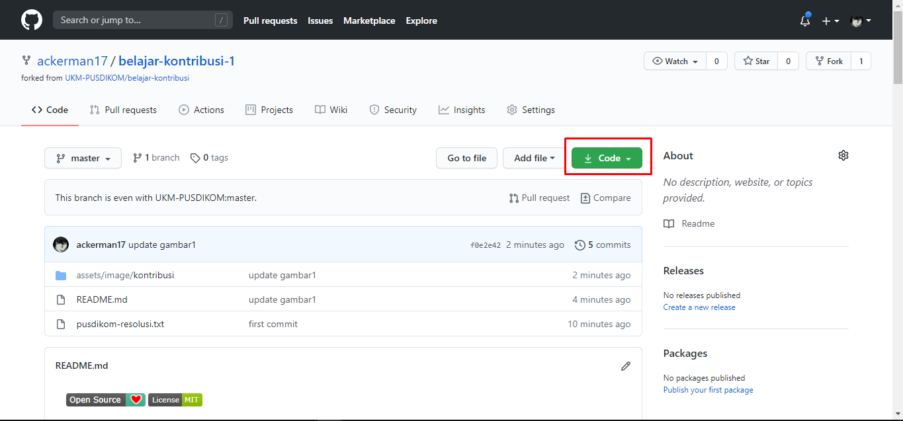

[](https://github.com/ellerbrock/open-source-badges/)
[](https://opensource.org/licenses/MIT)

# Belajar Kontribusi
Repositori untuk belajar kontribusi open source project.

## Fork Repositori
Fork repositori ini dengan cara menekan tombol fork di sebelah kanan atas. 


## Clone repositori hasil fork
Selanjutnya, clone repo hasil fork yang ada di akun kamu ke komputer local. Tekan tombol code, lalu tekan icon *copy to clipboard* .




Buka terminal lalu run git command di bawah ini:
```
git clone "url yang udah dicopy"
```

Misalnya:
```
git clone https://github.com/username-kamu/belajar-kontribusi.git
```
di mana `username-kamu` diisi sama username akun GitHub kamu.

## Buat branch baru
Setelah repositori di-clone, buka folder repositori:

```
cd belajar-kontribusi
```
Lalu buat branch baru menggunakan command `git branch <nama-kamu>`:

### Contohnya:
```
git branch hafidz-masruri
```
(Nama branch-nya bebas. Cuma mesti disesuaikan sama tujuan branch dibuat ya.)

## Checkout branch
setelah membuat branch baru , lalu checkout ke branch tersebut supaya bisa memulai pull request ,`git checkout <nama-kamu>`

### Contohnya : 
```
git checkout hafidz-masruri
```

## Modifikasi dan Commit
Buka file `pusdikom-resolusi.text` menggunakan text editor favorit kamu. Di sini kita pakai text biasa
, Nah sekarang di file `pusdikom-resolusi.text` tambahkan data resolusi materi kajian pusdikom kedepan nya: 

### Contoh : 
```
[1]. Python

    *** PYTHON Dasar ***
    - Tipe Data & Variabel
    - Percabangan & Perulangan
    - List
    - Method & Class
```

setelah itu masukkan data kamu di kontributor.md 

### Contoh:
```
1. [ackerman17](https://github.com/ackerman17) : Saya seorang web developer
```

Sekarang run command `git status` buat lihat modifikasi apa saja yang udah kamu lakukan. 
Selanjutnya tambahkan dengan menggunakan command `git add`:

```
git add pusdikom-resolusi.txt
git add kontributor.md
```
Lalu commit modifikasi yang udah kamu buat menggunakan command: `git commit`:
```
git commit -m "Add resolusi dan kontributor"
```
ganti `pesan commit` sesuai dengan keinginan kalian ya.

## Push ke GitHub
Push dengan command `git push`:
```
git push origin <nama-branch>
```
ubah `<nama-branch>` dengan nama branch yang udah dibuat.

### Contoh:
```
git push origin hafidz-masruri
```

## Pull Request
Kalau kamu buka repositori kamu di GitHub, kamu bisa lihat tombol `Compare & pull request` button.  Tekan tombol tersebut.


Nah selanjutnya tekan tombol Create pull request.


# Selesai .... Semoga Bermanfaat
