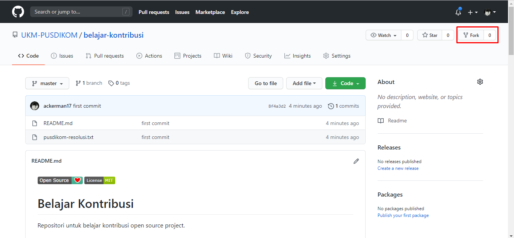
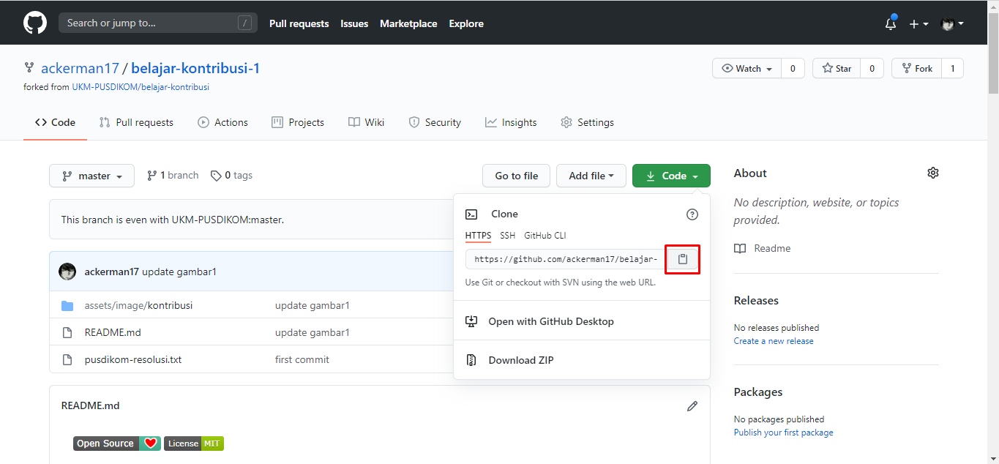
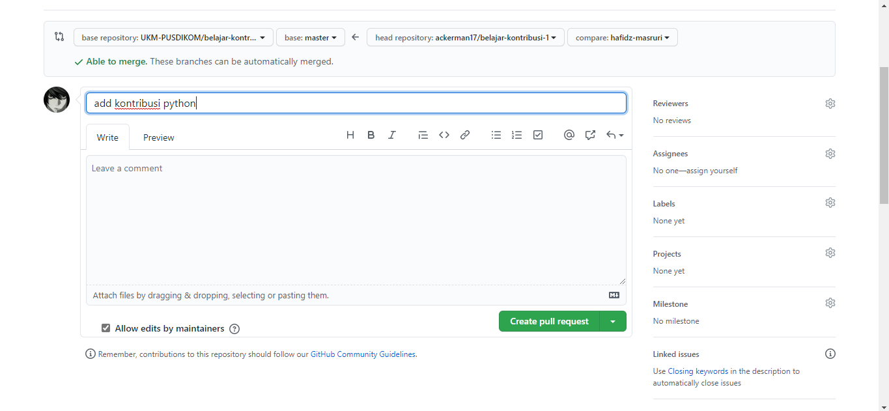

[](https://github.com/ellerbrock/open-source-badges/)
[](https://opensource.org/licenses/MIT)

# Belajar Kontribusi
Repositori untuk belajar kontribusi open source project.

## Fork Repositori
Fork repositori ini dengan cara menekan tombol fork di sebelah kan atas. 



## Clone repositori hasil fork
Selanjutnya, clone repo hasil fork yang ada di akun kamu ke komputer local. Tekan tombol clone, lalu tekan icon *copy to clipboard* .




Buka terminal lalu run git command di bawah ini:
```
git clone "url yang udah dicopy"
```


Misalnya:
```
git clone https://github.com/username-kamu/belajar-kontribusi.git
```
di mana `username-kamu` diisi sama username akun GitHub kamu.

## Buat branch baru
Setelah repositori di-clone, buka folder repositori:

```
cd belajar-kontribusi
```
Lalu buat branch baru menggunakan command `git checkout`:
```
git checkout -b <add-nama-kamu>
```

Contohnya:
```
git checkout -b add-gun-gun
```
(Nama branch-nya bebas. Cuma mesti disesuaikan sama tujuan branch dibuat ya.)

## Modifikasi dan Commit
Buka file `Contributors.md` menggunakan text editor favorit kamu. Di sini kita pakai Markdown. Tentang markdown bisa kamu baca-baca cheatsheet-nya [di sini yaa.](https://github.com/adam-p/markdown-here/wiki/Markdown-Cheatsheet).

Nah sekarang di file `Contributors.md` tambahkan data kamu di baris paling akhir ya: 

```
[no]. [nama-kamu](url-akun-github) : [Deskripsi tentang kamu]

```
Contohnya:
```
1. [Gun Gun Priatna](https://github.com/gungunpriatna) : Saya seorang web developer

```

Sekarang run command `git status` buat lihat modifikasi apa saja yang udah kamu lakukan. 
Selanjutnya tambahkan dengan menggunakan command `git add`:

```
git add Contributors.md
```
Lalu commit modifikasi yang udah kamu buat menggunakan command: `git commit`:
```
git commit -m "Add <nama-kamu> ke daftar kontributor"
```
ganti `<nama-kamu>` sama nama kamu ya.

## Push ke GitHub
Push dengan command `git push`:
```
git push origin <add-nama-kamu>
```
ubah `<add-nama-kamu>` dengan nama branch yang udah dibuat.

## Pull Request
Kalau kamu buka repositori kamu di GitHub, kamu bisa lihat tombol `Compare & pull request` button.  Tekan tombol tersebut.



Nah selanjutnya tekan tombol Create pull request.


